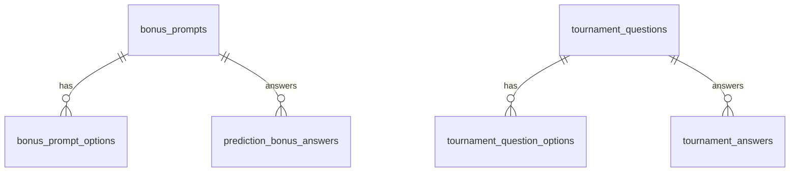

# Data model — MVP3

Extends existing MVP1/MVP2 schema (`matches`, `profiles`, `bonus_prompts`, `prediction_bonus_answers`, `tournament_questions`, `tournament_answers`).

## New / altered entities

### 1. `bonus_prompts` (alter)

| Column | Type | Notes |
|--------|------|--------|
| `input_type` | `text` check in (`text`, `single_choice`) | Default `single_choice` for new prompts; `text` preserves legacy free-text. |

### 2. `bonus_prompt_options` (new)

| Column | Type | Notes |
|--------|------|--------|
| `id` | uuid PK | |
| `prompt_id` | uuid FK → `bonus_prompts.id` | on delete cascade |
| `label` | text | Shown in dropdown |
| `value` | text | Stored/compared (may equal `label` or normalized code) |
| `sort_order` | int | Display order |
| `created_at` / `updated_at` | timestamptz | |

Unique optional: `(prompt_id, value)` if values must be distinct.

### 3. `tournament_questions` (alter)

| Column | Type | Notes |
|--------|------|--------|
| `visible_after_utc` | timestamptz null | If set, participants see question only when `now() >= visible_after_utc` **unless** manual reveal applies |
| `revealed_by_admin` | boolean not null default false | If true, question is visible to participants (subject to `is_active` and lock rules) |

**Visibility rule (participant read)**:

- Question shown when `is_active` and tournament lock not blocking submission, AND  
  `(revealed_by_admin OR (visible_after_utc IS NOT NULL AND now() >= visible_after_utc))`  
  with product tweak: if both unset/false, treat as **not yet visible** until admin sets date or reveal (configurable—default strict: require explicit reveal or date).

*Planning note*: Exact default when both null should match `research.md` precedence; migration may use `revealed_by_admin true` for existing rows to avoid hiding current questions.

### 4. `tournament_question_options` (new)

Same shape as `bonus_prompt_options` but `question_id` FK → `tournament_questions.id`.

### 5. `tournament_questions.input_type` (optional alter)

Mirror `bonus_prompts.input_type` if tournament answers stay text-only for some slots; else assume `single_choice` when options exist.

## Derived / no schema change

- **History sort key**: Computed in app or SQL view from `matches.external_key` (regex extract integer).
- **Leaderboard**: Uses existing `profiles.current_points` (and optionally hide `legacy_points` in UI).
- **Upcoming status**: Join `matches` + `predictions`; no new table.

## Relationships (Mermaid)

## Validation rules

- Insert/update `prediction_bonus_answers.answer_text` / tournament answer: if parent is `single_choice` and options exist, value must match one option `value` (check in API or constraint trigger).
- Empty option list + `single_choice`: disallow participant submit (API returns validation error); admin UI warns on save.
