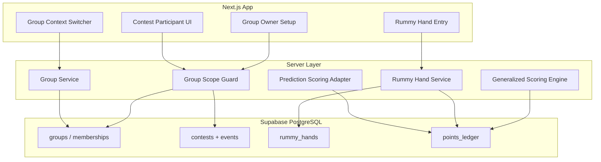

# Implementation Plan: Dual-Mode Scoring with Private Groups

**Branch**: `005-prediction-rummy-groups` | **Date**: 2026-05-19 | **Spec**: [spec.md](./spec.md)  
**Input**: Feature specification from `specs/005-prediction-rummy-groups/spec.md`

## Summary

Extend `duos-scoring-app` with **private group tenancy** (invite codes, multi-group membership, active group context), **group-only** prediction contests with **full bonus parity**, and **points-rummy** score-entry contests with owner/scorer hand recording. Builds additively on the generalized scoring platform (004) and match/tournament scoring adapters, with RLS-enforced isolation and phased rollout flags.

## Technical Context

**Language/Version**: TypeScript 5.x (Node.js 20 LTS)  
**Primary Dependencies**: Next.js App Router, React, Supabase JS/SSR, Tailwind CSS, shadcn/ui  
**Storage**: Supabase PostgreSQL (additive migrations: `groups`, memberships, `group_id` on contests, `rummy_hands`)  
**Testing**: `npm run lint`; unit tests for Rummy preset math and group RLS helpers; integration tests for join/isolation  
**Target Platform**: Web (desktop/mobile browser)  
**Project Type**: Full-stack Next.js + Supabase  
**Performance Goals**: Leaderboard/history p95 &lt; 3s for ≤50 members, ≤30 active contests per group (SC-007)  
**Constraints**: Group-only tenancy; points rummy only in v1; owners configure, scorers record hands  
**Scale/Scope**: Informal teams &lt;50 members; dual format per group; no global participant contests

## Constitution Check

*GATE: Must pass before Phase 0 research. Re-check after Phase 1 design.*

| Principle | Alignment |
|---|---|
| **I. Incremental compatibility** | Phased rollout (`GROUP_SCOPING_ENABLED`); prediction via match-scoring adapter; group-only contest routes |
| **II. Security / roles** | RLS on `group_id`; owner/scorer/member matrix; session-validated active group |
| **III. Auditable scoring** | Ledger append for Rummy hands/corrections; prediction uses existing immutable ledger patterns |
| **IV. Contract-driven gates** | Spec FR-* → contracts → tasks; SC-001–SC-008 verification in quickstart |
| **V. Admin-first operability** | Group owners (not platform admins) configure contests; plain-language errors |

- Pre-research gate: **PASS**
- Post-design gate: **PASS**

## Project Structure

### Documentation (this feature)

```text
specs/005-prediction-rummy-groups/
├── plan.md
├── research.md
├── data-model.md
├── quickstart.md
├── contracts/
│   ├── README.md
│   ├── groups-and-tenancy.md
│   ├── prediction-parity.md
│   └── rummy-scoring.md
└── tasks.md             # Phase 2 — /speckit.tasks (not created by plan)
```

### Source Code (repository root)

```text
app/
├── (authenticated)/
│   ├── groups/                    # NEW: create, join, switch, settings
│   ├── contests/                  # scoped by active group
│   └── history/
├── (authenticated)/groups/[groupId]/contests/new/  # group-owner contest wizard
├── admin/                         # platform operator only (optional; not group-owner setup)
└── api/
    ├── groups/                    # NEW
    └── generalized-scoring/       # extend with group_id guards

components/
├── groups/                        # NEW (includes contest-wizard/)
├── contests/
└── rummy/                         # NEW hand entry UI

lib/
├── server/groups/                 # NEW: membership, invite, context
├── server/rummy/                  # NEW: preset math, hand service
├── scoring/                       # existing match-scoring (prediction bridge)
└── server/generalized-scoring/   # extend repositories for group_id

supabase/migrations/
└── 2026*_groups_and_rummy_*.sql  # NEW additive migrations

docs/rollout/
└── group-scoping.md               # NEW flags doc
```

**Structure Decision**: Single Next.js app; new `lib/server/groups` and `lib/server/rummy` modules; extend existing generalized and season scoring paths rather than new services.

## Complexity Tracking

No constitution violations requiring justification.

---

## Phase 0: Research

**Status**: Complete → [research.md](./research.md)

Key decisions: group tenancy tables, session active group, reusable rotating invite codes, owner/scorer roles, prediction adapter, points-rummy hand tables, RLS membership policies, phased flags.

---

## Phase 1: Design

**Status**: Complete

| Artifact | Path |
|---|---|
| Data model | [data-model.md](./data-model.md) |
| Contracts | [contracts/](./contracts/) |
| Quickstart validation | [quickstart.md](./quickstart.md) |

### Architecture overview



### Implementation phases (rollout)

| Phase | Deliverable | Flag |
|---|---|---|
| **G1** | Schema: groups, memberships, invite history; RLS; GRANTs | `GROUP_SCOPING_ENABLED` |
| **G2** | UI/API: create/join/switch group; active context middleware | same |
| **G3** | `group_id` on contests; block unscoped participant routes | same |
| **G4** | Prediction parity in group (bridge + owner result entry + bonuses) | `GROUP_PREDICTION_ENABLED` |
| **G5** | Points rummy preset + hand UI + ledger | `GROUP_RUMMY_ENABLED` |
| **G6** | Greenfield deploy docs + column cleanup migration | one-time |

### Data handling (greenfield)

- All contests require `group_id`; no global participant contests.
- Reuse `lib/scoring/match-scoring.ts`, `season-bonuses-tab.ts`, `tournament-question-visibility.ts` behind `GroupPredictionAdapter` scoped by `group_id`.
- Generalized tables use `contest_points_ledger` for group/rummy; season `points_ledger` for match/tournament scoring.

### API surface (new / extended)

| Area | Method / route | Notes |
|---|---|---|
| Groups | `POST /api/groups` | Create |
| Groups | `POST /api/groups/join` | Body: `invite_code` |
| Groups | `POST /api/groups/switch` | Body: `group_id` |
| Groups | `POST /api/groups/invite/regenerate` | Owner |
| Groups | `POST /api/groups/members/scorer` | Owner toggles `is_scorer` |
| Rummy | `POST /api/groups/.../rummy/hands` | Owner/scorer |
| Contests | existing generalized routes | Require `group_id` + membership guard |

### Observability (deferred detail in tasks)

- Log join failures, cross-group 403s, hand correction counts
- Optional rate limit on `/join` (noted in spec deferral)

---

## Phase 2: Task breakdown

**Not produced by `/speckit.plan`.** Run **`/speckit.tasks`** to generate `tasks.md` from this plan and the spec.

---

## Post-design Constitution Check

All five principles satisfied with documented phased delivery and RLS enforcement. **PASS**.

## Generated artifacts

| File | Description |
|---|---|
| `plan.md` | This plan |
| `research.md` | Phase 0 decisions |
| `data-model.md` | Entities, RLS, validation |
| `quickstart.md` | Manual verification script |
| `contracts/*` | Group, prediction parity, rummy contracts |

**Suggested next command**: `/speckit.tasks`
