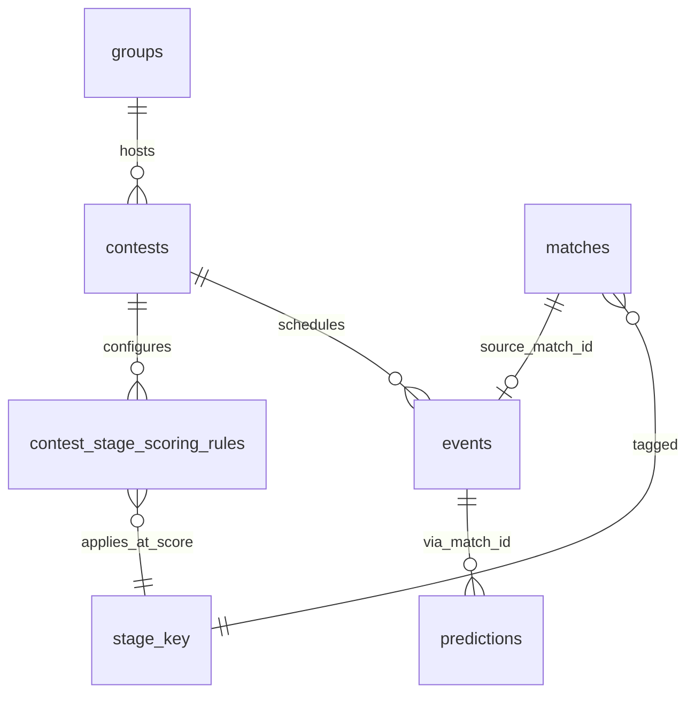

# Data Model — FIFA World Cup 2026 Private Prediction Game

## Modeling approach

- **Tenant**: existing `groups` (005); v1 targets one primary group via deployment config.
- **Fixtures**: extend `matches` with World Cup metadata; link to group contests via `events.source_match_id`.
- **Stage policy**: new `contest_stage_scoring_rules` + reveal timestamps per contest.
- **Scoring**: extend `applyMatchScoring` to read stage rules (correct + incorrect penalty); bonuses unchanged.
- **Catalog import**: `import_batches` audit + optional `worldcup_import_runs` for operator traceability.
- **Additive-only** migrations; RLS + explicit GRANTs per Supabase rule.

## New entities

### 1) `contest_stage_scoring_rules`

Per-contest stage scoring and reveal gate.

| Field | Type | Rules |
|---|---|---|
| `id` | UUID | PK |
| `contest_id` | UUID FK | → `contests.id`, `group_id` denormalized for RLS |
| `group_id` | UUID FK | → `groups.id` |
| `stage_key` | text | Stable key from dataset (`group_stage`, `round_of_32`, …) |
| `stage_name` | text | Display label (“Round of 16”) |
| `stage_order` | integer | Sort key 1–7 from `tournament_stages` |
| `correct_points` | integer | Default from spec table |
| `incorrect_penalty` | integer | ≤ 0; Group Stage = 0 |
| `revealed_at` | timestamptz nullable | Null = hidden from members |
| `created_at` / `updated_at` | timestamptz | System |

**Uniqueness**: (`contest_id`, `stage_key`).

**Defaults** (seed on contest create from template):

| stage_key | correct | incorrect |
|---|---|---|
| group_stage | 2 | 0 |
| round_of_32 | 3 | -1 |
| round_of_16 | 5 | -2 |
| quarter_finals | 8 | -3 |
| semi_finals | 12 | -4 |
| third_place | 8 | -3 |
| final | 20 | -10 |

### 2) `worldcup_import_runs` (optional audit)

| Field | Type | Rules |
|---|---|---|
| `id` | UUID | PK |
| `group_id` | UUID FK | Owner who ran import |
| `dataset_slug` | text | e.g. `areezvisram12/fifa-world-cup-2026-match-data-unofficial` |
| `dataset_version` | text nullable | Kaggle version hash if known |
| `row_counts` | jsonb | `{ matches, teams, cities, stages }` |
| `status` | enum | `running`, `success`, `failed` |
| `error_log` | jsonb nullable | Owner-facing summary only |
| `created_at` | timestamptz | |

## Extended entities

### `matches` (additive columns)

| Field | Type | Rules |
|---|---|---|
| `match_number` | integer | 1–104, unique per season import |
| `season_year` | integer | Default 2026 |
| `stage_key` | text | FK logical to stage rules |
| `venue_label` | text | Stadium / city display |
| `home_team_display` | text | Denormalized; sync on import |
| `away_team_display` | text | Denormalized |
| `external_team_home_id` | text nullable | Dataset team id |
| `external_team_away_id` | text nullable | Dataset team id |
| `dataset_version` | text nullable | For re-import merge |

Existing: `external_key` (use `wc2026:m{match_number}`), `match_time_utc`, `status`, `winner`, `bonus_result`.

**`matches.winner` values**:

- Group stage: home team display name, away team display name, or **`Draw`** (regulation tie).
- Knockout: winning team display name only (never `Draw`).

**Re-import merge rules**:

- Upsert by `external_key`; update `match_time_utc`, team display names, `venue_label` if match not `completed`.
- Never change `winner`/`status` on completed matches without owner void/correction flow.

### `contests` / `events` (005 bridge)

- World Cup contest: `game_type` prediction, `group_id` set, `tournament_scope_id` → `group_tournament_config`.
- On import: bulk-create `events` one per match with `source_match_id`, `lock_at` default = `match_time_utc` (owner may override per event).
- `events` carry `stage_key` denormalized for filtered queries.

### `scoring_config` (contest-level override path)

- **Deprecated for winner points** in World Cup contests when stage rules exist; `match_winner_points` ignored if `contest_stage_scoring_rules` present for event’s stage.
- `match_bonus_points` still drives bonus line awards.

### Unchanged (005 / Rummy)

- `groups`, `group_memberships`, `rummy_hands`, `rummy_hand_players`, `points_ledger`, `bonus_prompts`, `group_tournament_config`, generalized ledger where used.

## State transitions

### Match (`matches.status`)

`scheduled` → `open` (revealed stage + before lock) → `locked` (at lock) → `completed` (owner entered winner) → optional `voided` via void service.

Member picks: allowed only in `open` for revealed stages.

### Stage reveal (`contest_stage_scoring_rules.revealed_at`)

`null` (hidden) → owner sets timestamp → members see matches in that stage and scoring row in “How points work” panel.

### Scoring run

Owner sets official outcome on completed match (`winner` as team name or `Draw` in group stage) → `applyMatchScoring` reads stage rule → ledger lines:

- `source_type=match`, `reason=match_winner` or `match_winner_miss` with `points_delta` positive or negative.
- Bonus lines unchanged.

## RLS summary

| Table | Select | Mutate |
|---|---|---|
| `contest_stage_scoring_rules` | Group members if `revealed_at` set OR user is owner (owners see all) | Owner only |
| `matches` (WC rows) | Group members when linked to active contest event in revealed stage | Owner import + result entry |
| `worldcup_import_runs` | Group owner | Owner insert |

## Validation rules

- `incorrect_penalty` must be ≤ 0; `correct_points` ≥ 0.
- Cannot unreveal a stage that has scored matches unless owner acknowledges (UI warning).
- Pick submission blocked when `revealed_at` is null or `now() >= lock_at` (deterministic boundary messaging).
- Owner may override `events.lock_at` independently of `matches.match_time_utc` after import.
- Placeholder team names allowed; display copy uses “Team TBD” pattern.

## Entity relationship (logical)

