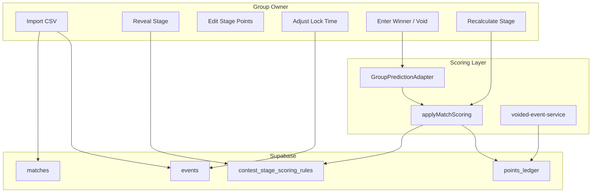

# Implementation Plan: FIFA World Cup 2026 Private Prediction Game

**Branch**: `006-fifa-world-cup-predictions` | **Date**: 2026-05-20 | **Spec**: [spec.md](./spec.md)  
**Input**: Feature specification from `specs/006-fifa-world-cup-predictions/spec.md`  
**Revision**: Post-`/speckit.analyze` — incorporates FR-017 void/correction, lock override, stage recalculate, SC-005/SC-006 verification

## Summary

Personalize `duos-scoring-app` for a **single private group** (~11 players, US Eastern Time) running a **FIFA World Cup 2026 winner-prediction** season with **104 imported fixtures**, **progressive stage reveal**, and **stage-dependent correct/incorrect scoring** (including knockout penalties). Reuse 005 group tenancy and prediction bonus parity; extend `applyMatchScoring` for negative miss deltas; add CSV import from the Kaggle dataset; simplify member navigation via deployment flags; wire **void/correction** and **owner lock overrides** for World Cup events; **leave Rummy unchanged**.

## Technical Context

**Language/Version**: TypeScript 5.x (Node.js 20 LTS)  
**Primary Dependencies**: Next.js App Router, React, Supabase JS/SSR, Tailwind CSS, shadcn/ui, `csv-parse` (import script)  
**Storage**: Supabase PostgreSQL (additive: `contest_stage_scoring_rules`, `worldcup_import_runs`, `matches` WC columns, `events.lock_at` overrides)  
**Testing**: `npm run lint`; `world-cup-stage-scoring.spec.ts` (SC-003); `world-cup-stage-reveal.spec.ts` (SC-005); group prediction parity; Rummy quickstart regression  
**Target Platform**: Web (desktop/mobile browser), private deployment  
**Project Type**: Full-stack Next.js + Supabase  
**Performance Goals**: Leaderboard/history p95 &lt; 3s with 11 members + 104 events (SC-006) — verify via quickstart timing + query indexes on `events.stage_key`, `contest_id`  
**Constraints**: Owner-triggered import; EST display only; stage reveal gate; Rummy freeze; hide legacy surfaces via flags; prerequisite **005** group migrations applied  
**Scale/Scope**: 1 primary group, 104 matches, 7 stages, 11 users

## Constitution Check

*GATE: Must pass before Phase 0 research. Re-check after Phase 1 design.*

| Principle | Alignment |
|---|---|
| **I. Incremental compatibility** | Extend `matches` + group adapter; flags `WORLD_CUP_PRIVATE_MODE`; no deletion of IPL/generalized tables |
| **II. Security / roles** | RLS on new tables; reveal gate in queries; owner-only import/reveal/scoring/void |
| **III. Auditable scoring** | Ledger append for `match_winner_miss`; `recalculate-stage` appends adjustments; void via `voided-event-service` |
| **IV. Contract-driven gates** | FR-* → contracts → tasks; SC-001–SC-008 in quickstart + integration tests |
| **V. Admin-first operability** | Owner import/reveal/lock edit; plain-language errors; `app-nav` not platform admin for members |

- Pre-research gate: **PASS**
- Post-design gate: **PASS** (after analyze remediation items below)

## Project Structure

### Documentation (this feature)

```text
specs/006-fifa-world-cup-predictions/
├── plan.md
├── research.md
├── data-model.md
├── quickstart.md
├── contracts/
│   ├── README.md
│   ├── world-cup-import.md
│   ├── stage-scoring-reveal.md
│   ├── void-and-correction.md      # NEW (FR-017)
│   └── simplified-shell.md
└── tasks.md
```

### Source Code (repository root)

```text
app/
├── (authenticated)/
│   ├── groups/[groupId]/
│   │   ├── world-cup/import/page.tsx
│   │   └── world-cup/stages/page.tsx
│   └── contests/[contestId]/
│       ├── matches/page.tsx          # dedicated 104-fixture schedule
│       └── events/[eventId]/page.tsx
├── page.tsx                          # WORLD_CUP_PRIVATE_MODE redirect
└── api/groups/[groupId]/
    ├── world-cup/import/route.ts
    └── contests/[contestId]/
        ├── stages/route.ts
        ├── events/[eventId]/lock/route.ts   # NEW lock override
        ├── results/route.ts
        └── void/route.ts                    # NEW void/correction

components/
├── world-cup/
└── layout/app-nav.tsx                  # member nav (not app-header)

lib/
├── scoring/match-scoring.ts            # stage penalties
├── server/world-cup/                   # import, reveal, recalculate-stage
├── server/groups/prediction-adapter.ts
├── utils/eastern-time.ts
└── copy/world-cup.ts

scripts/import-worldcup-2026.ts
tests/integration/
├── world-cup-stage-scoring.spec.ts
└── world-cup-stage-reveal.spec.ts
```

**Structure Decision**: Single Next.js app; dedicated `contests/[contestId]/matches` route for full schedule; void/lock APIs under group contest namespace.

## Complexity Tracking

No constitution violations requiring justification.

---

## Post-Analyze Design Updates (2026-05-20)

| Analyze ID | Resolution in this plan |
|---|---|
| C1 FR-017 | New contract `void-and-correction.md`; wire `voided-event-service` for WC events |
| C2 FR-010 | Owner `PATCH events.lock_at` API + UI on schedule/stages |
| C3 FR-007 | `recalculateStageScoring` server module (append ledger), not doc-only |
| C4 SC-005 | `world-cup-stage-reveal.spec.ts` in test plan |
| C5 SC-006 | Quickstart timing step + index on `events(contest_id, stage_key)` |
| I1 | Nav changes target `components/layout/app-nav.tsx` |

---

## Phase 0: Research

**Status**: Complete → [research.md](./research.md)

Key decisions: extend `matches`, stage rules table, CSV import, EST `Intl`, private mode flags, penalty scoring, void/correction reuse, lock override, stage recalculate.

---

## Phase 1: Design

**Status**: Complete

| Artifact | Path |
|---|---|
| Data model | [data-model.md](./data-model.md) |
| Contracts | [contracts/](./contracts/) |
| Quickstart | [quickstart.md](./quickstart.md) |

### Architecture overview



### Implementation phases

| Phase | Focus | Depends on |
|---|---|---|
| **A — Schema** | Migrations + indexes for `stage_key`, stage rules, import audit | 005 applied |
| **B — Import** | CSV script, owner import UI, event linker | A |
| **C — Stage scoring** | `applyMatchScoring` penalties, recalculate-stage | A |
| **D — Reveal + schedule** | Stages page, `matches/page.tsx`, reveal filter | A, C |
| **E — Ops** | Lock override, void/correction, EST copy | B, D |
| **F — Shell** | Private mode nav (`app-nav`), redirects | B |
| **G — Contest template** | WC wizard preset + default stage rows | B, D |
| **H — Verification** | quickstart, integration tests, lint, SC-006 spot check | All |

### Critical code change (scoring)

When `contest_stage_scoring_rules` applies:

- Correct pick → `correct_points` (`match_winner`)
- Wrong pick → `incorrect_penalty` (`match_winner_miss`)
- Recalculate and void → append ledger via existing services (no silent overwrite)

### Rollout

See [docs/rollout/world-cup-private.md](../docs/rollout/world-cup-private.md) (created in tasks):

```env
GROUP_SCOPING_ENABLED=true
GROUP_PREDICTION_ENABLED=true
WORLD_CUP_IMPORT_ENABLED=true
WORLD_CUP_PRIVATE_MODE=true
DEFAULT_GROUP_ID=<uuid-after-bootstrap>
```

---

## Phase 2: Tasks

**Status**: See [tasks.md](./tasks.md) — refresh after this plan revision to include T059+ remediation tasks.

---

## Agent context

Run: `.specify/scripts/powershell/update-agent-context.ps1 -AgentType cursor-agent`
